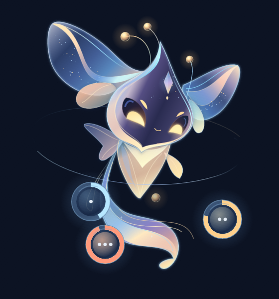

# Claude Pet

An animated desktop pet that shows your Claude plan usage at a glance: your current session, your weekly limit, and any per-model weekly limit, each with its reset time.

> **Unofficial.** Claude Pet is a community project and is not affiliated with or endorsed by Anthropic. It reads usage from an undocumented endpoint that can change or break at any time.



## What it does

- Sits on your taskbar (bottom-left by default). Drag it anywhere; it stays on screen and snaps back onto the taskbar when you drop it near it.
- If your taskbar is at the top or side, hides itself, or isn't on that monitor, the bottom of the screen is its ground instead. It keeps a few pixels clear of the screen edges so a hidden taskbar can still slide out, and with a hidden taskbar it starts a little way in from the left, clear of the Start or Widgets button. A taskbar that slides out can still cover it; drag it aside if it's in the way.
- With more than one monitor it can sit across the seam and move from one to the next where they meet. A monitor's bottom edge is only ground where no monitor continues below it, so a pet that lies down on the upper of two stacked monitors drifts down to the taskbar below.
- The three orbs orbiting the pet are your meters: one dot = session, two = weekly, three = your per-model weekly limit (e.g. Fable). Their rings fill and turn amber, then red, as you use more.
- Click the pet to open the full stats: percentages, bars, reset times and countdowns. Click again, or anywhere else, to close. Only the pet itself takes clicks and touches: the see-through space around it passes them to whatever is underneath.
- Left alone for a few minutes with Claude quiet, it drifts down to the taskbar and lounges. When Claude gets busy it perks up: Claude Code shows its working poses right away, and other use like Claude chat (noticed when your usage goes up) keeps it awake and attentive for a few minutes. It sleeps when you're away from the computer or the Claude app isn't running, and checks usage less often while it naps.
- Gets worried near your limits, sighs and gets tired when one is hit, and celebrates when a limit resets (the orbs drain and refill).
- Waves hello once a day (the first time it's awake and on screen), looks for a connection if it can't read your usage, and waves goodbye when you quit.

## Playing with it

- **Drag** it around: it dangles and leans, bonks if you push it into a screen edge (not where two monitors meet), gets dizzy if you shake it, and lands when you drop it on the taskbar (where it sits).
- **Rub** the cursor back and forth over it to pet it.
- **Double-click** for a trick; **triple-click** to tickle it.
- Right-click → **Play**: feed it a spark, have it chase your cursor, or ask for a trick. The same menu shows its happiness and level.
- **Free roam**: every 10–25 minutes, when nothing's going on, it takes a little trip along the taskbar (or, if you allow it, somewhere on screen), pauses to look around, and comes back. It waits for your cursor to move out of its way, heads home if Claude needs you, and clicking it calls it home. Changing its size or your monitors during a trip also sends it home. Choose off / along the taskbar / anywhere on screen under right-click → **Play**, or send it on a stroll right away (available while it's idle, sitting or lounging).
- Playing and finished Claude Code tasks raise its happiness and experience; ignored for hours, it gets a little droopy.
- It grows as it levels up (level 1 at 30 XP, 2 at 120, 3 at 300): longer tail wisps, then an extra antenna pearl and brighter stars, then a soft halo and crown.
- Right-click → **Appearance** to pick a color theme (celestial blue, rose gold, mint aqua, violet silver) and the night glow: softer light between 10 PM and 7 AM by default, or always / never. The usage orbs keep their colors in every theme.
- Tray icon: show/hide, refresh now, open Claude's usage page, launch at startup, settings, and copy troubleshooting info.
- `Ctrl+Alt+P` hides or shows it (for windowed games, screen shares, and so on). While hidden it stays silent. `Alt+F4` on the pet hides it too; quit from the tray or right-click menu.

## Requirements

- Windows 10/11 (macOS/Linux may work but are untested)
- [Node.js](https://nodejs.org) 20+
- A Claude Pro or Max plan, signed in to **Claude Code** on this computer

## Install (Windows)

1. Download **Claude Pet Setup** from the [Releases](https://github.com/elysium1331/claude-pet/releases) page.
2. Run it. It installs for your user only (no admin needed), adds **Claude Pet** to the Start Menu and your desktop, and starts the pet.
3. Windows may warn that the app is from an unknown publisher, because it isn't code-signed yet. Choose **More info → Run anyway**.

After that, start it any time from the Start Menu or desktop shortcut. To have it start with Windows, right-click the pet (or the tray icon) and turn on **Launch at startup**. Uninstall it from Windows **Settings → Apps**.

Uninstalling also removes the pet's Claude Code hooks and its startup entry. It leaves two things for you to keep or delete: the pet's settings, happiness and level in `%APPDATA%\claude-pet`, and the last backup of Claude Code's settings, `settings.json.claude-pet-backup`, next to Claude Code's `settings.json`.

## Run from source

```bash
git clone https://github.com/elysium1331/claude-pet.git
cd claude-pet
npm install
npm start
```

If `npm start` says Electron failed to install, run `node node_modules/electron/install.js` once and try again.

## How it gets your usage

Claude Pet uses the login that Claude Code already saved on your computer (`.credentials.json` in `%USERPROFILE%\.claude`) to ask Anthropic for your plan usage, about every 2 minutes (every 10 while Claude is closed). Checking usage does not use up any of your usage.

- Your token is only ever sent to Anthropic. It is never logged, copied or uploaded anywhere else.
- When the saved login expires, Claude Pet renews it the same way Claude Code does and saves it back to the same file. It takes Claude Code's renewal lock, so it waits while Claude Code is renewing. It never replaces a newer login that Claude Code saved, and it only saves a reply that is a complete login. If the file can't be saved right then (another program has it open, say), the pet keeps the renewed login in memory, tries again to save it every few seconds, and once more when it quits.
- If the stats say **Run `claude` once in a terminal to sign in**, open a terminal, run `claude` (sign in if it asks), then `/exit`. The pet notices the new login within about 15 seconds. **Refresh usage now** in the right-click or tray menu checks right away.
- If a limit's reset time passes while the pet can't check (you're offline, or signed out), that meter shows as reset until the next successful check.
- If you use `CLAUDE_CONFIG_DIR` to move Claude Code's folder, Claude Pet reads the login and adds hooks there too. Set it as a Windows user environment variable (Settings → System → About → Advanced system settings → Environment Variables), not only in a shell profile: the pet starts from the Start Menu, so it can't see variables that only a terminal sets. The `credentialsPath` setting can point at a different credentials file.

## Connect to Claude Code (optional)

Right-click the pet or the tray icon and choose **Connect to Claude Code…**. The pet then reacts to what Claude Code is doing:

- **Thinking / working:** thinking pose while Claude reads your prompt, busy pose while it runs tools
- **Needs you:** rings a bell and waits when Claude asks for permission, and nods when you approve. If you press Esc or deny the permission instead, it stops waiting about a minute later, when Claude Code reports that it's idle.
- **Done:** celebrates when a longer task finishes
- **Oops:** flinches when a tool fails

This adds hooks to Claude Code's user settings: `settings.json` in `%USERPROFILE%\.claude`, or in `CLAUDE_CONFIG_DIR` if you set it. Each hook uses `curl`, which comes with Windows 10 and 11, to send the event to the pet at `127.0.0.1:47821` on your own computer, never through a proxy. Nothing leaves your machine.

- The hooks run in the background. Claude Code doesn't wait for them and ignores any reply, so no program listening on that port can approve a tool or change what Claude does. If the pet isn't running, Claude Code simply carries on.
- While the pet isn't running, Claude Code still sends each event, including your prompts and what tools read and write, to `127.0.0.1:47821`, where any other program using that port could read it. If the pet won't be running, turn on **Launch at startup** or choose **Disconnect from Claude Code…**.
- Every event carries a random token that only your Windows account can read, kept in `%APPDATA%\claude-pet\hooks-token.json`. The pet ignores events without it, so other programs and other accounts on the same PC can't fake them.
- Before changing the file, the pet saves a copy of it as `settings.json.claude-pet-backup` next to it. There is only ever one backup, replaced each time. Your other settings and hooks are left alone, and a symlinked settings file stays a link.
- If another program is already using the port, the pet tells you, won't connect and never moves its hooks there. Hooks that were already sending that program your events gave it the token, so the pet makes a new one, which the hooks get once the pet has its port again. Set `hooksPort` to a free port and restart the pet.
- Hooks added by an older version of Claude Pet, or pointing at an old port, are updated automatically when the pet starts and has its port. Claude Code sessions that were already open may need a restart to pick up the change.
- Choose **Disconnect from Claude Code…** to remove the hooks again. Uninstalling Claude Pet removes them too.
- If the pet doesn't react, right-click → **Copy troubleshooting info** copies what the pet thinks is going on to the clipboard: whether it's listening, whether the hooks are installed, and what each Claude Code session is doing.

While the pet is hidden it stays silent.

## Settings

Right-click the pet or the tray icon and choose **Open settings file** (`%APPDATA%\claude-pet\config.json`). Save your changes, then quit the pet and start it again to apply them. The pet keeps your edits even if it's still running while you edit: it only ever saves the settings you change from its menus.

- A setting with the wrong type or an out-of-range value falls back to its default, and the pet tells you which one when it starts.
- If the file isn't valid JSON (a trailing comma or a missing quote, say), the pet runs on default settings, saves a copy as `config.json.broken-<time>`, tells you, and leaves your file alone until you fix it and restart.
- If Claude Pet can't start at all, it shows why and exits, so you can fix the problem and start it again. Errors are also written to `claude-pet.log` in the same folder.

| Setting | Default | What it does |
|---|---|---|
| `pollMinutes` | `2` | How often to check usage while Claude is running (minutes, at least 1) |
| `idlePollMinutes` | `10` | How often to check while Claude is closed (minutes, at least 1) |
| `warnAtPercent` | `85` | When the pet starts looking worried |
| `loungeAfterMinutes` | `3` | Minutes without touching the pet before it lies down |
| `loungeOnTaskbar` | `true` | Drift down onto the taskbar before lounging |
| `sleepWhenAwayMinutes` | `10` | Minutes without keyboard/mouse input before it sleeps |
| `fidgets` | `true` | Occasional idle animations (if the pet has them) |
| `roam` | `"taskbar"` | Free roam: `"off"`, `"taskbar"` or `"screen"` |
| `roamMinMinutes` / `roamMaxMinutes` | `10` / `25` | How long it waits between trips (minutes, at least 1) |
| `strollPose` | `"float"` | Taskbar strolls: `"float"` at normal size, or `"walk"` with the compact walking gait |
| `hooksPort` | `47821` | Local port Claude Code hooks send events to, 1024–65535. The pet moves its hooks to the new port when it restarts. |
| `celebrateAfterSeconds` | `20` | Only celebrate Claude Code tasks that took at least this long |
| `hideHotkey` | `CommandOrControl+Alt+P` | Show/hide shortcut; `null` for none |
| `launchAtStartup` | `false` | Also toggleable from the tray menu |
| `claudeProcessNames` | `["claude.exe", "claude"]` | Processes that count as "Claude is running" |
| `scopedLimit` | `null` | Which per-model weekly limit to show (e.g. `"Fable"`); `null` = first one reported |
| `petScale` | `1` | Pet size: `0.8`, `1`, `1.25` or `1.5` (also in right-click → Appearance → Size) |
| `taskbarPose` | `"float"` | On the taskbar: `"float"` keeps its normal size, `"sit"` sits (more compact) |
| `ambientMotion` | `true` | Random ear twitches and tail drift (if the pet supports them) |
| `palette` | `0` | Color theme (also in right-click → Appearance) |
| `nightMode` | `"auto"` | Softer night glow: `true`, `false`, or `"auto"` (between `nightStartHour` and `nightEndHour`, default 22–7) |
| `lightBackdrop` | `"auto"` | Stronger outline for light desktops: `true`, `false`, or `"auto"` (follows Windows theme) |
| `credentialsPath` | `null` | Custom path to Claude Code's credentials file; `null` = `.credentials.json` in `CLAUDE_CONFIG_DIR`, or in `%USERPROFILE%\.claude` |
| `pet` | `"celestial-fox"` | Which pet to show: the folder name of a built-in pet or one you added (letters, digits, `.`, `_` and `-` only) |

## Make your own pet

A pet is a folder with a [Rive](https://rive.app) file and a `pet.json` that maps the app's values onto the file's view model. Put your own pets in the `pets` folder next to your settings file, for example `%APPDATA%\claude-pet\pets\my-pet\pet.json`, then set `"pet": "my-pet"` in the settings. (The built-in pets are in the app's own `pets/` folder, which is read-only in the installed app.)

If the chosen pet is missing, its `pet.json` has a mistake, or its Rive file can't be drawn, Claude Pet shows the built-in Celestial Fox instead and tells you what went wrong.

```json
{
  "name": "Celestial Fox",
  "file": "celestial-fox.riv",
  "artboard": "CelestialFox",
  "stateMachine": "PetStateMachine",
  "binding": {
    "stateProperty": "state",
    "usageProperties": { "session": "session", "weekly": "weekly", "model": "fable" },
    "lightBackdropProperty": "lightBackdrop"
  },
  "states": { "idle": 0, "sleeping": 1, "working": 2, "needsAttention": 3, "done": 4, "idea": 5, "lowUsage": 6, "limitReached": 7 }
}
```

- `file` (the `.riv` file in the same folder) and `states` (pose names mapped to numbers) are required.
- `stateProperty`: a Number the app sets to one of the `states` values.
- `usageProperties`: Numbers (0–100) for the orbs. Leave any out if your pet has no meters; the chips under the pet always show the numbers.
- `lightBackdropProperty`: an optional Boolean.
- Optional extras: `usageColorProperties` (Colors for the orb rings), `statsOpenProperty` / `statsSideProperty`, `hoveredProperty`, `lookXProperty` / `lookYProperty` (gaze, -1..1).
- `reactions`: view-model Trigger names for `wake`, `appear` and `disappear` (one name each); event reactions such as `tricks` may list several names to take turns. `fidgets`: `{ "trigger", "ms", "states" }` entries played at random while idle (or in the listed states).
- `bodyInsets` / `stateInsets`: how much of the pet box is transparent margin on each side (fractions from 0 to 0.95), overall and per pose, so the body stays on screen. Pets that really turn can give `{ "left": {...}, "right": {...} }` with both directions.
- `timings`: `disappearMs`, `goodbyeMs` and `statsMergeMs` in milliseconds; anything above 5000 is treated as 5000.

See [pets/celestial-fox/state-map.md](pets/celestial-fox/state-map.md) for a full example.

## Development

```bash
npm test
```

Useful flags for `npx electron .`:

- `--fake-usage=path/to/usage.json`: use a saved response instead of the network
- `--claude-running=true|false`: override Claude app detection
- `--pet-state=lounging`: force a pet state
- `--start-at=x,y`: start the pet at a screen position (it is clamped on screen)
- `--remove-hooks`: remove the pet's Claude Code hooks and its startup entry, then exit without showing anything (the uninstaller runs this)
- `--snapshot=out.png [--snapshot-stats]`: save a picture of the pet (and the stats panel), then quit. Snapshot runs use saved usage numbers and never contact Anthropic, even when Claude opens or closes or you choose **Refresh usage now**; add `--live-usage` to fetch real ones.

## License

TBD
